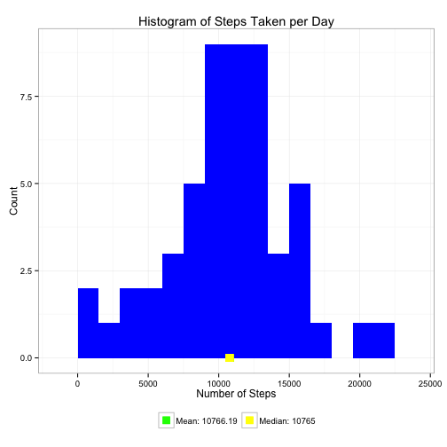
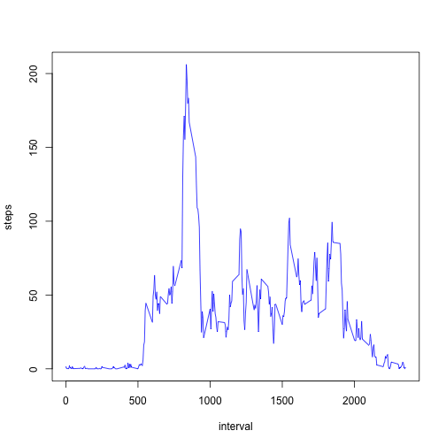
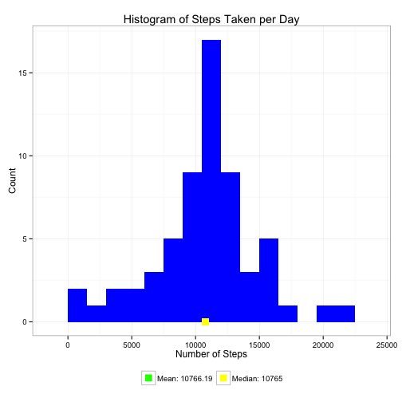
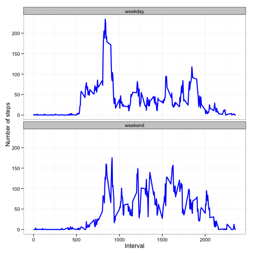

Introduction
------------------------------------------
It is now possible to collect a large amount of data about personal movement using activity monitoring devices such as a **Fitbit, Nike Fuelband, or Jawbone Up**. These type of devices are part of the “quantified self” movement – a group of enthusiasts who take measurements about themselves regularly to improve their health, to find patterns in their behavior, or because they are tech geeks. 

This test makes use of data from a personal activity monitoring device. This device collects data at 5 minute intervals through out the day. The data consists of two months of data from an anonymous individual collected during the months of October and November, 2012 and include the number of steps taken in 5 minute intervals each day.

Loading and preprocessing the data.
---------------------------------------------------
The data can be downloaded using the below R script.

```r
downloadFiles <- function(dataURL = "https://d396qusza40orc.cloudfront.net/repdata%2Fdata%2Factivity.zip") {
    if (!file.exists("./activity.csv")) {
        # dir.create('./data')
        temp <- tempfile()
        download.file(dataURL, temp, method = "curl")
        unzip(temp, exdir = "./data/")
        unlink(temp)
    } else {
        message("data already downloaded.")
    }
}
```


The variables included in this dataset are:
- **steps**: Number of steps taking in a 5-minute interval (missing values are coded as NA)
- **date**: The date on which the measurement was taken in YYYY-MM-DD format
- **interval**: Identifier for the 5-minute interval in which measurement was taken, (in the format of hhmm, 830 mean 8:30am, 2355 means 23:55)

The dataset is stored in a comma-separated-value (CSV) file and there are a total of 17,568 observations in this dataset.


```r
fname = "./activity.csv"
if (!file.exists(fname)) downloadFiles()
data <- read.csv("./activity.csv")
data$date <- as.Date(data$date, format = "%Y-%m-%d")

summary(data)
```

```
##      steps            date               interval   
##  Min.   :  0.0   Min.   :2012-10-01   Min.   :   0  
##  1st Qu.:  0.0   1st Qu.:2012-10-16   1st Qu.: 589  
##  Median :  0.0   Median :2012-10-31   Median :1178  
##  Mean   : 37.4   Mean   :2012-10-31   Mean   :1178  
##  3rd Qu.: 12.0   3rd Qu.:2012-11-15   3rd Qu.:1766  
##  Max.   :806.0   Max.   :2012-11-30   Max.   :2355  
##  NA's   :2304
```

```r
head(data)
```

```
##   steps       date interval
## 1    NA 2012-10-01        0
## 2    NA 2012-10-01        5
## 3    NA 2012-10-01       10
## 4    NA 2012-10-01       15
## 5    NA 2012-10-01       20
## 6    NA 2012-10-01       25
```

```r
str(data)
```

```
## 'data.frame':	17568 obs. of  3 variables:
##  $ steps   : int  NA NA NA NA NA NA NA NA NA NA ...
##  $ date    : Date, format: "2012-10-01" "2012-10-01" ...
##  $ interval: int  0 5 10 15 20 25 30 35 40 45 ...
```


What is mean total number of steps taken per day?
---------------------------------------------------
- Make a histogram of the total number of steps taken each day
- Calculate and report the mean and median total number of steps taken per day

```r
library(ggplot2)

stepsPerDay <- aggregate(steps ~ date, data, sum)
colnames(stepsPerDay) <- c("date", "steps")
meanSteps <- round(mean(stepsPerDay$steps), 2)
medianSteps <- round(median(stepsPerDay$steps), 2)

col_labels <- c(paste("Mean:", meanSteps), paste("Median:", medianSteps))
cols <- c("green", "yellow")

ggplot(stepsPerDay, aes(x = steps)) + geom_histogram(fill = "blue", binwidth = 1500) + 
    geom_point(aes(x = meanSteps, y = 0, color = "green"), size = 4, shape = 15) + 
    geom_point(aes(x = medianSteps, y = 0, color = "yellow"), size = 4, shape = 15) + 
    scale_color_manual(name = element_blank(), labels = col_labels, values = cols) + 
    labs(title = "Histogram of Steps Taken per Day", x = "Number of Steps", 
        y = "Count") + theme_bw() + theme(legend.position = "bottom")
```

 

The mean total number of steps per day is 1.0766 &times; 10<sup>4</sup>, the median is 1.0765 &times; 10<sup>4</sup>.

What is the average daily activity pattern?
---------------------------------------------------
- Make a time series plot (i.e. type = "l") of the 5-minute interval (x-axis) and the average number of steps taken, averaged across all days (y-axis)
- Which 5-minute interval, on average across all the days in the dataset, contains the maximum number of steps?

```r
stepsPerInterval <- aggregate(steps ~ interval, data, FUN = mean, na.rm = TRUE)
colnames(stepsPerInterval) <- c("interval", "steps")
stepsPerInterval$interval <- as.integer(stepsPerInterval$interval)
plot(stepsPerInterval, type = "l", col = "blue")
```

 

```r

maxStepInterval <- stepsPerInterval[which.max(stepsPerInterval$steps), ]$interval
```

The interval 835 contains the maximum number of steps.

Imputing missing values
---------------------------------------------------
- Note that there are a number of days/intervals where there are missing values (coded as NA). The presence of missing days may introduce bias into some calculations or summaries of the data.

- Calculate and report the total number of missing values in the dataset (i.e. the total number of rows with NAs)

- Devise a strategy for filling in all of the missing values in the dataset. The strategy does not need to be sophisticated. For example, you could use the mean/median for that day, or the mean for that 5-minute interval, etc.

- Create a new dataset that is equal to the original dataset but with the missing data filled in.

- Make a histogram of the total number of steps taken each day and Calculate and report the mean and median total number of steps taken per day. Do these values differ from the estimates from the first part of the assignment? What is the impact of imputing missing data on the estimates of the total daily number of steps?


```r
na_indices <- which(is.na(data$steps))
nMissing <- nrow(na_indices)
dataMeans <- stepsPerInterval
na_replacements <- unlist(lapply(na_indices, FUN = function(idx) {
    interval = data[idx, ]$interval
    dataMeans[dataMeans$interval == interval, ]$steps
}))
imp_steps <- data$steps
imp_steps[na_indices] <- na_replacements
imp_data <- data.frame(steps = imp_steps, date = data$date, interval = data$interval)
```

Here the missing values were replaced using the means values of same interval across days, assuming the activities in daily routine.
Summary the updated dataset.

```r
summary(imp_data)
```

```
##      steps            date               interval   
##  Min.   :  0.0   Min.   :2012-10-01   Min.   :   0  
##  1st Qu.:  0.0   1st Qu.:2012-10-16   1st Qu.: 589  
##  Median :  0.0   Median :2012-10-31   Median :1178  
##  Mean   : 37.4   Mean   :2012-10-31   Mean   :1178  
##  3rd Qu.: 27.0   3rd Qu.:2012-11-15   3rd Qu.:1766  
##  Max.   :806.0   Max.   :2012-11-30   Max.   :2355
```

The total number of missing values in the dataset: 


```r
imp_stepsPerDay <- aggregate(steps ~ date, imp_data, sum)
colnames(imp_stepsPerDay) <- c("date", "steps")
meanSteps <- round(mean(imp_stepsPerDay$steps), 2)
medianSteps <- round(median(imp_stepsPerDay$steps), 2)

ggplot(imp_stepsPerDay, aes(x = steps)) + geom_histogram(fill = "blue", binwidth = 1500) + 
    geom_point(aes(x = meanSteps, y = 0, color = "green"), size = 4, shape = 15) + 
    geom_point(aes(x = medianSteps, y = 0, color = "yellow"), size = 4, shape = 15) + 
    scale_color_manual(name = element_blank(), labels = col_labels, values = cols) + 
    labs(title = "Histogram of Steps Taken per Day", x = "Number of Steps", 
        y = "Count") + theme_bw() + theme(legend.position = "bottom")
```

 

Comparing with the previously calculations, the mean value remains unchanghed (since we imputed the means), the median value has shifted closer to the mean.

Are there differences in activity patterns between weekdays and weekends?
--------------------------------------------------------------------------
- Create a new factor variable in the dataset with two levels – “weekday” and “weekend” indicating whether a given date is a weekday or weekend day.

- Make a panel plot containing a time series plot (i.e. type = "l") of the 5-minute interval (x-axis) and the average number of steps taken, averaged across all weekday days or weekend days (y-axis). 


```r
data$dayOfWeek <- (weekdays(as.Date(data$date, "%Y-%m-%d")) %in% c("Saturday", 
    "Sunday"))
for (i in 1:nrow(data)) {
    if (data$dayOfWeek[i]) {
        data$dayOfWeek[i] <- "weekend"
    } else {
        data$dayOfWeek[i] <- "weekday"
    }
}
data$dayOfWeek <- factor(data$dayOfWeek)

spi_dayOfWeek <- aggregate(steps ~ interval + dayOfWeek, data, FUN = mean, na.rm = TRUE)

# qplot(interval, steps,
# data=spi_dayOfWeek,facets=.~dayOfWeek)+geom_line(color='steelblue',
# size=1)

ggplot(spi_dayOfWeek, aes(x = interval, y = steps)) + geom_line(color = "blue", 
    size = 1) + facet_wrap(~dayOfWeek, nrow = 2, ncol = 1) + labs(x = "Interval", 
    y = "Number of steps") + theme_bw()
```

 

Activity on the weekends tends to be more spread out than the weekday,
weekday's activities are more focus on morning 8-9am. One possible reason is weekday activities are more work related, whereas weekends tend to be more adhoc.

