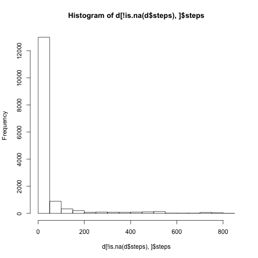
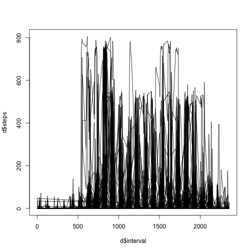

Title


```r
downloadFiles<-function(
dataURL="https://d396qusza40orc.cloudfront.net/repdata%2Fdata%2Factivity.zip"

){
if(!file.exists("./data/activity.csv")){
dir.create("./data")
temp <-tempfile()
download.file(dataURL, temp, method="curl")
unzip(temp,exdir="./data/")
## rename dir-name ""UCI HAR Dataset" to "UCI_HAR_Dataset"
# mv UCI\ HAR\ Dataset/ UCI_HAR_Dataset
# file.rename("UCI HAR Dataset", "UCI_HAR_Dataset")
unlink(temp)
}else{
message("data already downloaded.")
}
}
```


```r
d <- read.csv("data/activity.csv")
hist(d[!is.na(d$steps), ]$steps)
```

 

```r

dsteps <- d[!is.na(d$steps), ]$steps
summary(dsteps)
```

```
##    Min. 1st Qu.  Median    Mean 3rd Qu.    Max. 
##     0.0     0.0     0.0    37.4    12.0   806.0
```

```r
mean(d[!is.na(d$steps), ]$steps)
```

```
## [1] 37.38
```

```r
median(d[!is.na(d$steps), ]$steps)
```

```
## [1] 0
```

```r

plot(d$interval, d$steps, type = "l")
```

 

```r

summary(d$steps)
```

```
##    Min. 1st Qu.  Median    Mean 3rd Qu.    Max.    NA's 
##     0.0     0.0     0.0    37.4    12.0   806.0    2304
```

```r
nrow(d[is.na(d$steps), ])
```

```
## [1] 2304
```

```r

summary(d)
```

```
##      steps               date          interval   
##  Min.   :  0.0   2012-10-01:  288   Min.   :   0  
##  1st Qu.:  0.0   2012-10-02:  288   1st Qu.: 589  
##  Median :  0.0   2012-10-03:  288   Median :1178  
##  Mean   : 37.4   2012-10-04:  288   Mean   :1178  
##  3rd Qu.: 12.0   2012-10-05:  288   3rd Qu.:1766  
##  Max.   :806.0   2012-10-06:  288   Max.   :2355  
##  NA's   :2304    (Other)   :15840
```

