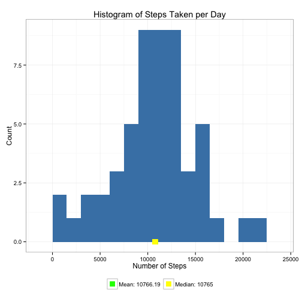
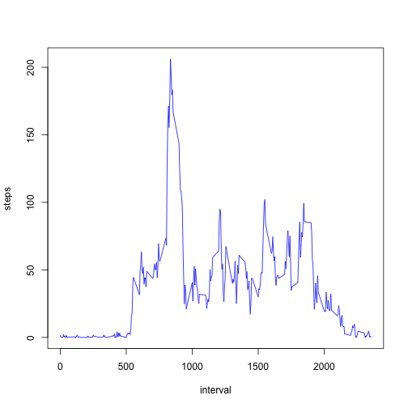

It is now possible to collect a large amount of data about personal movement using activity monitoring devices such as a Fitbit, Nike Fuelband, or Jawbone Up. These type of devices are part of the “quantified self” movement – a group of enthusiasts who take measurements about themselves regularly to improve their health, to find patterns in their behavior, or because they are tech geeks. But these data remain under-utilized both because the raw data are hard to obtain and there is a lack of statistical methods and software for processing and interpreting the data.

This assignment makes use of data from a personal activity monitoring device. This device collects data at 5 minute intervals through out the day. The data consists of two months of data from an anonymous individual collected during the months of October and November, 2012 and include the number of steps taken in 5 minute intervals each day.

The data can be downloaded.

```r
downloadFiles <- function(dataURL = "https://d396qusza40orc.cloudfront.net/repdata%2Fdata%2Factivity.zip") {
    if (!file.exists("./data/activity.csv")) {
        dir.create("./data")
        temp <- tempfile()
        download.file(dataURL, temp, method = "curl")
        unzip(temp, exdir = "./data/")
        unlink(temp)
    } else {
        message("data already downloaded.")
    }
}
downloadFiles()
```

```
## data already downloaded.
```


Loading and preprocessing the data.

```r
data <- read.csv("data/activity.csv")
summary(data)
```

```
##      steps               date          interval   
##  Min.   :  0.0   2012-10-01:  288   Min.   :   0  
##  1st Qu.:  0.0   2012-10-02:  288   1st Qu.: 589  
##  Median :  0.0   2012-10-03:  288   Median :1178  
##  Mean   : 37.4   2012-10-04:  288   Mean   :1178  
##  3rd Qu.: 12.0   2012-10-05:  288   3rd Qu.:1766  
##  Max.   :806.0   2012-10-06:  288   Max.   :2355  
##  NA's   :2304    (Other)   :15840
```

```r
head(data)
```

```
##   steps       date interval
## 1    NA 2012-10-01        0
## 2    NA 2012-10-01        5
## 3    NA 2012-10-01       10
## 4    NA 2012-10-01       15
## 5    NA 2012-10-01       20
## 6    NA 2012-10-01       25
```

```r
str(data)
```

```
## 'data.frame':	17568 obs. of  3 variables:
##  $ steps   : int  NA NA NA NA NA NA NA NA NA NA ...
##  $ date    : Factor w/ 61 levels "2012-10-01","2012-10-02",..: 1 1 1 1 1 1 1 1 1 1 ...
##  $ interval: int  0 5 10 15 20 25 30 35 40 45 ...
```


What is mean total number of steps taken perday?

```r
dataNoNA <- data[!is.na(data$steps), ]
hist(dataNoNA$steps, xlab = "steps")
```

 

```r
meanSteps <- mean(dataNoNA$steps)
medianSteps <- median(dataNoNA$steps)
```

The mean total number of steps is 37.3826, the median is 0.

What is the average daily activity pattern?
* Make a time series plot (i.e. type = "l") of the 5-minute interval (x-axis) and the average number of steps taken, averaged across all days (y-axis)
* Which 5-minute interval, on average across all the days in the dataset, contains the maximum number of steps?

```r
plot(dataNoNA$interval, dataNoNA$steps, type = "l")
```

 

```r

maxStepInterval <- dataNoNA[dataNoNA$steps == max(dataNoNA$steps), ]
```

The interval 615 contains the maximum number of steps?
